# **IQ KIDS**

The IQ Kids Hamburg website is for parents and their children aged 6 to 12 who want to make the most of their summer vacation. The IQ Kids Hamburg Early Development School offers 2 - 3 week programs as part of the city camp.
Site users have full access to information including general information about the school, available programs, pricing, contact information and registration form. This site is targeted at parents who want to keep their children busy during the school summer holidays.

Visit the live website <a href="https://kseniasos.github.io/iq-kids/" target="_blank" rel="noopener">IQ KIDS</a>

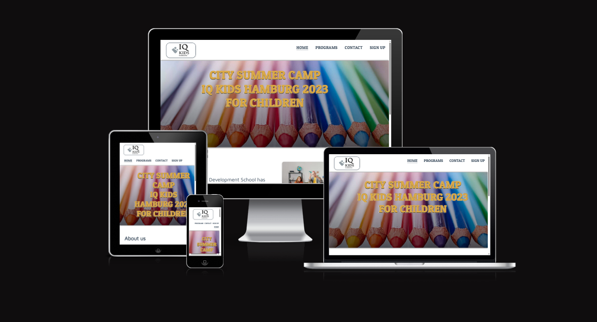

# Contents

- [**IQ KIDS**](#iq-kids)
- [Contents](#contents)
- [User Experience (UX)](#user-experience-ux)
  - [Wireframes](#wireframes)
  - [Site Structure](#site-structure)
  - [Design Choices](#design-choices)
- [Features](#features)
  - [Existing Features](#existing-features)
- [Technologies Used](#technologies-used)
- [Testing](#testing)
  - [Code Validation](#code-validation)
  - [Responsiveness Test](#responsiveness-test)
  - [Browser Compatibility](#browser-compatibility)
  - [Known Bugs](#known-bugs)
  - [Additional Testing](#additional-testing)
    - [Lighthouse](#lighthouse)
- [Deployment](#deployment)
    - [**Deploying the project**](#deploying-the-project)
    - [**Forking the repository on GitHub**](#forking-the-repository-on-github)
    - [**Creating a local clone of this project**](#creating-a-local-clone-of-this-project)
- [Credits](#credits)
    - [Content](#content)
    - [Media](#media)
    - [Acknowledgements](#acknowledgements)

# User Experience (UX)

## Wireframes

The wireframes for IQ KIDS were produced in [Balsamiq](https://balsamiq.com). There are frames for a full width display, tablets and a small mobile device.

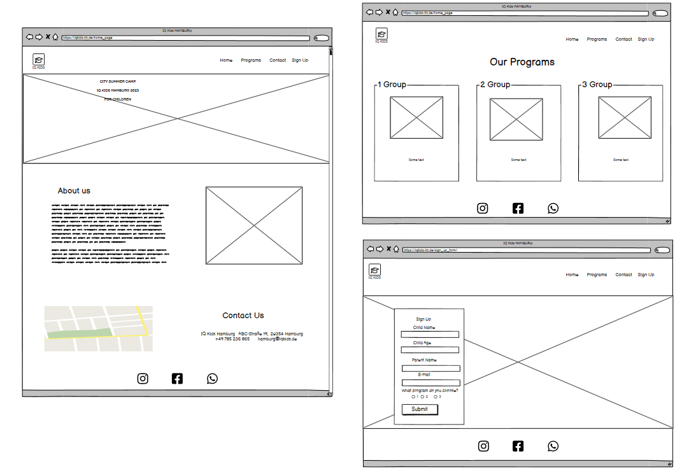

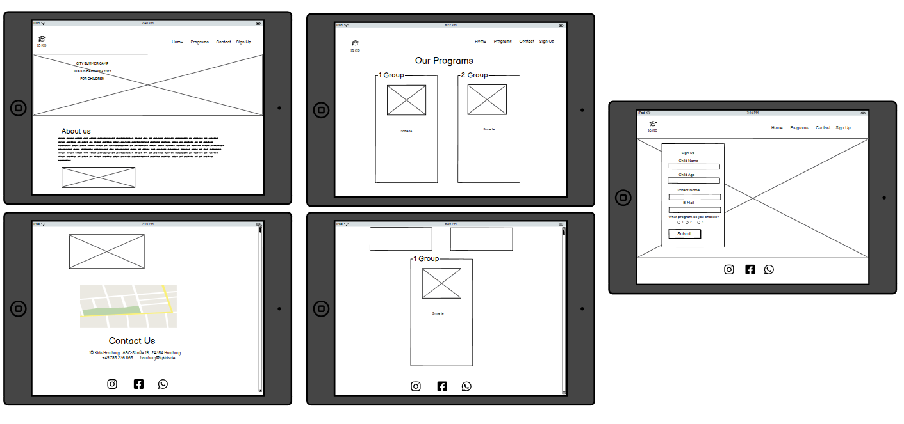

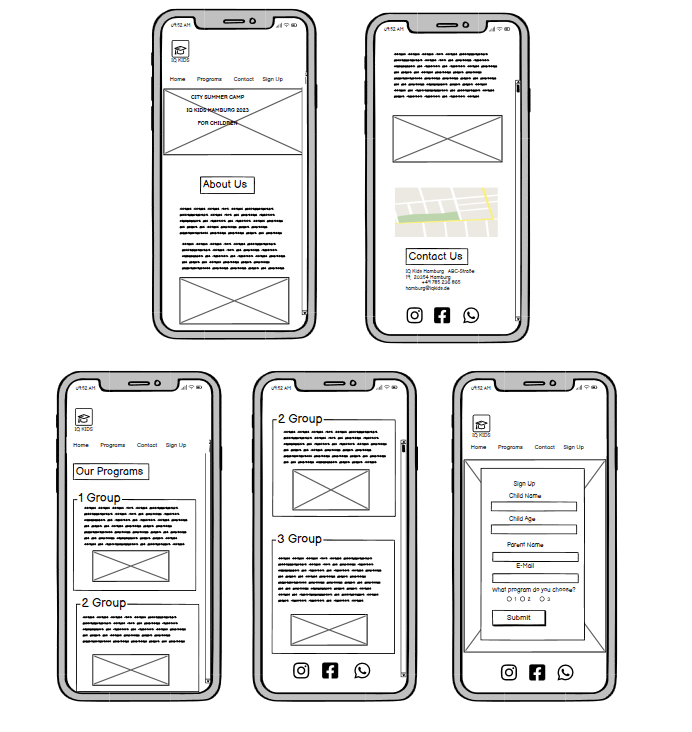

[Back to top](<#contents>)

## Site Structure

The IQ Kids site consists of 3 main pages: [Home page](index.html), [Our Programs](programs.html) and [Sign Up](form.html).There is also a Sign up [confirmation page](formdestination.html). All pages of the website have the same body layout: Header and Footer.

[Back to top](<#contents>)

## Design Choices

* ### Typography
  
  The fonts chosen were '_Patua One_' for the headings and menu. '_Maven Pro_' was used for the paragraph content.
  
* ### Colour Scheme

   This color palette is dominated by bright colors. They blend well without being overly flashy. IQ KIDS is a children's establishment, so I wanted to reflect children's bright emotions in colors. This is what IQ KIDS will hopefully be able to convey to the user.

   The following colors were used on the website.
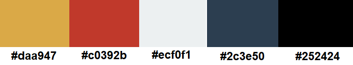

[Back to top](<#contents>)

# Features

The IQ KIDS website is designed to be friendly and easy to use. Many functions, such as the navigation and the form, are familiar and understandable to the user and may be of interest to move further through the site.

## Existing Features  

* ### Navigation Menu

  * The full responsive navigation bar includes the clicable logo on the right side. It links back to the home page.  
  * The Menu is on the left side. It links to different main pages of the website or different sections on the home page (contact).
  * This header is located at the top of every page.

[Back to top](<#contents>)

* ### The Landing Page Image
  
  * The landing page includes an image with text overlay so that the user can see what the site has to offer.
  * The image of pencils may be associated by the user with creativity or study.

  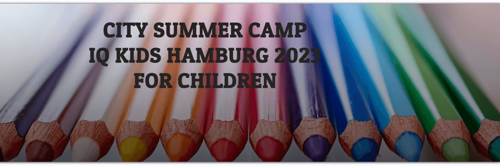
  
[Back to top](<#contents>)

* ### About Us

  * The About Us section lets the user know what IQ KIDS is and who we are.
  * The introductory text is accompanied by an image of the class where the teacher  is with the students.

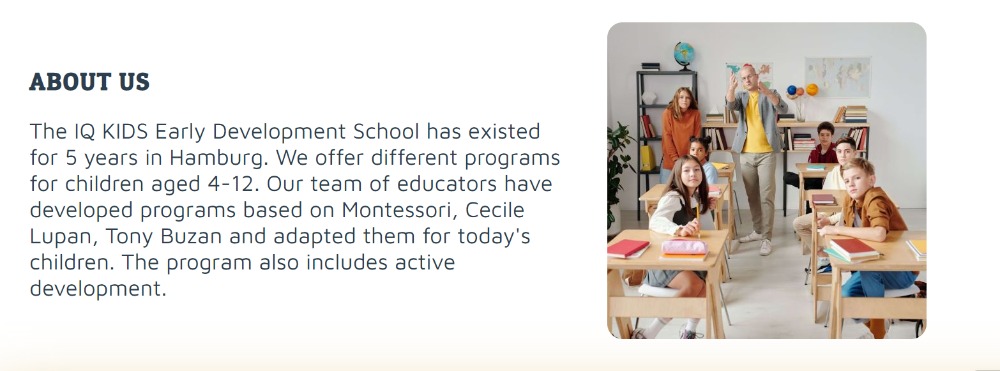

[Back to top](<#contents>)

* ### Contact Us

  * This section contains the map and contact details (the data is a work of fiction and is used for demonstrative purposes within the present project).

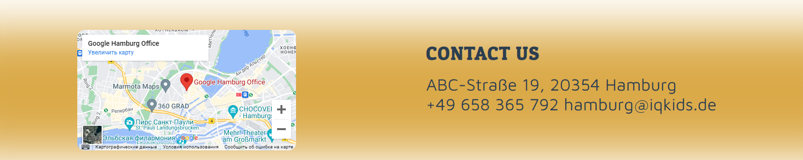

[Back to top](<#contents>)

* ### Footer

  * The Footer includes social media icons. For the convenience of the user, the links open in other tabs. There, users may find gallery and reviews of other clients on Instagram or Facebook and videos from events on Youtube.
  
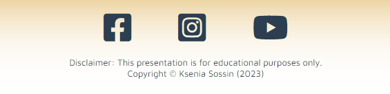

[Back to top](<#contents>)

* ### Programs
  
  * This section shows the user three programs, which differ in age, pricing and event dates.
  * This section will be updated as these dates or pricing change to keep the user up to date.

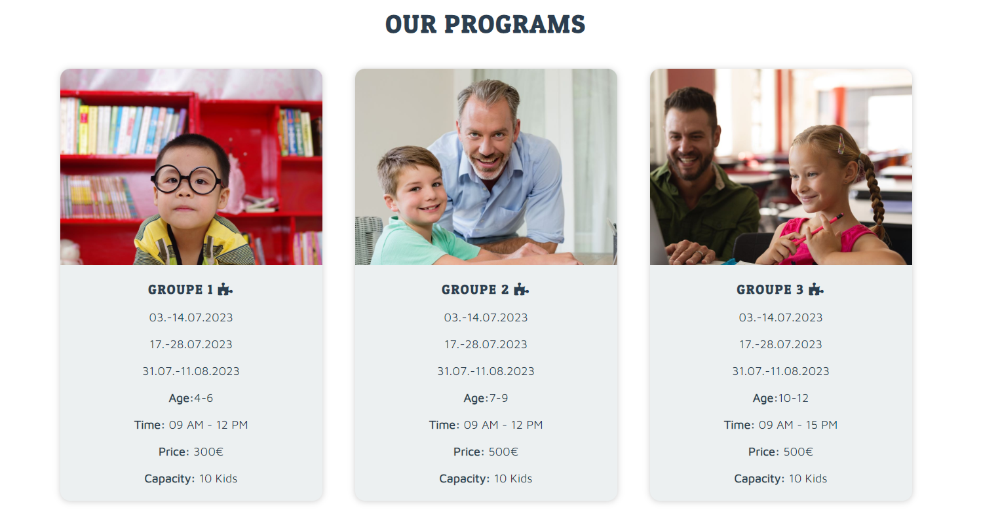

* ### Sign Up Form
  
  * On this page the user can leave a request to sign up for an event.
  * The form consists of 5 input fields. The user needs to enter both his own and the child's data. In addition, the user also needs to choose which group he wants to be in.

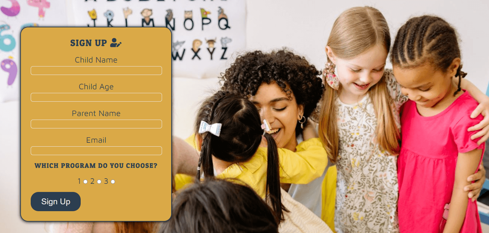

* ### Form Confirmation

  * After filling out the form, the user will be redirected to a thank you page.

  * The user will be notified that their data has been accepted and will be contacted.

  * All fields must be filled. If the user tries to submit an empty form, they will be prompted to fill in the empty fields.

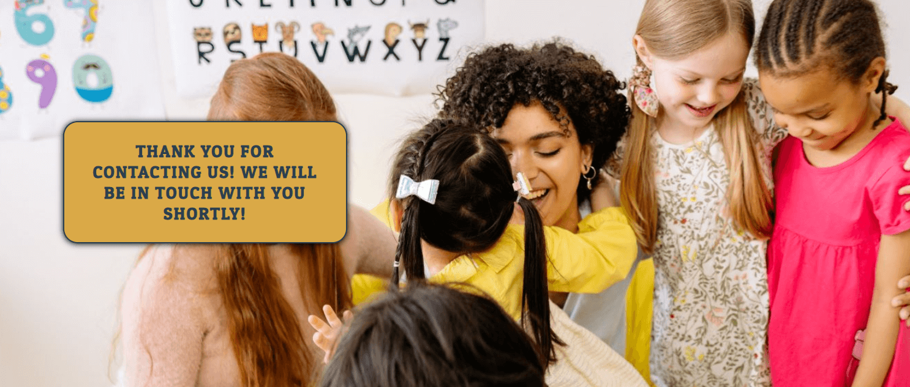

[Back to top](<#contents>)

* ## Future features

  * Gallery section, where the user can immediately see images of previous events.
  * Review section, where the user will see the impressions of other users.

[Back to top](<#contents>)

# Technologies Used

* [HTML5](https://html.spec.whatwg.org/)
* [CSS](https://www.w3.org/Style/CSS/Overview.en.html)
* [Balsamiq](https://balsamiq.com/wireframes/)
* [CodeAnywhere](https://app.codeanywhere.com/)
* [Github](https://github.com/)
  
[Back to top](<#contents>)

# Testing

## Code Validation

The IQ KIDS website has been throughly tested. All HTML pages have been run through the [W3C html Validator](https://validator.w3.org/) and the CSS throught the [W3C CSS Validator](https://jigsaw.w3.org/css-validator/). Minor errors were found, after fixing and retesting, no more errors found.

The HTML validator results for each page are below:

* Home page

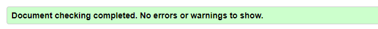

* Our Programs page

* Sign Up Form page

* Form Confirmation page

The CSS validator results are below:

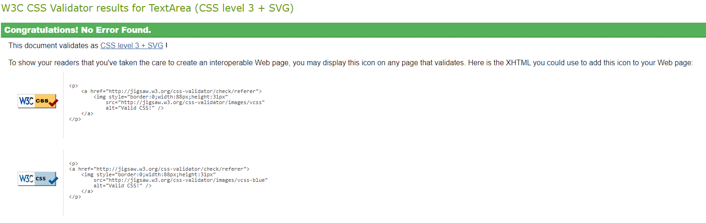

[Back to top](<#contents>)

## Responsiveness Test

* The responsive design tests were carried out manually with [Google Chrome DevTools](https://developer.chrome.com/docs/devtools/) and [Responsive Design Checker](https://www.responsivedesignchecker.com/).

|        | Moto G4 | Galaxy S5 | iPhone 5 | iPad | iPad Pro | Display <1200px | Display >1200px |
|--------|---------|-----------|----------|------|----------|-----------------|-----------------|
| Render | pass    | pass      | pass     | pass | pass     | pass            | pass            |
| Images | pass    | pass      | pass     | pass | pass     | pass            | pass            |
| Links  | pass    | pass      | pass     | pass | pass     | pass            | pass            |

## Browser Compatibility

The IQ KIDS website can work properly on Google Chrome, Microsoft Edge and Safari. The site has the same functionality, appearance and responsiveness on different devices with different sizes.

## Known Bugs

* ### Resolved

   Bugs were found during the validation and a brief description is provided below:

    * Home page  
    Top-level heading _h1_ was used in all sections and pages, which is not a good practice. Therefore, it was corrected accordingly.
    
    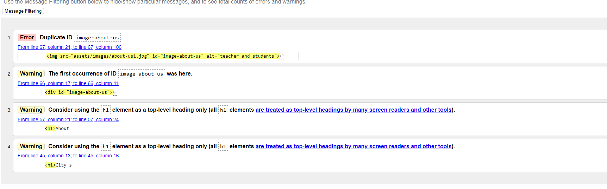
  
    * Our Programs page  
    Element _hr_ was nor allowed in lists. It was easily fixed by deleting all _hr_ from _ul_.
    
    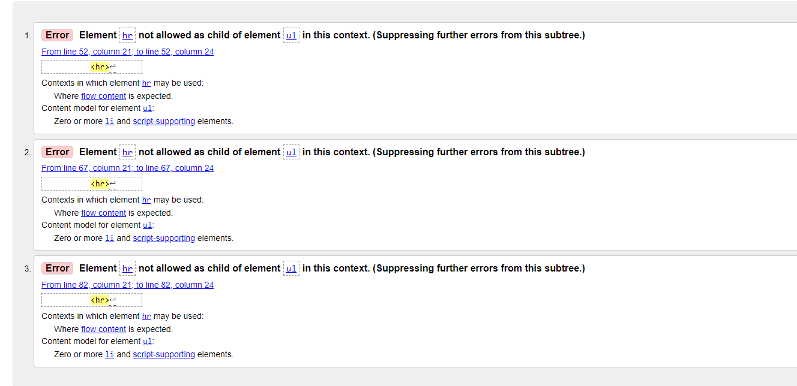

    * Sign Up Form page
    There was a mistake in a word, so id value for attribites _label_ and _for_ was not identical. It was easily fixed by correct spelling of the word.
  
    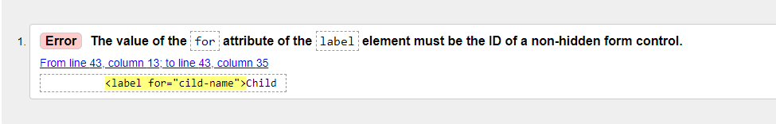

    * CSS
    There was a margin without unit. It was easily fixed by adding unit after margin number.
  
    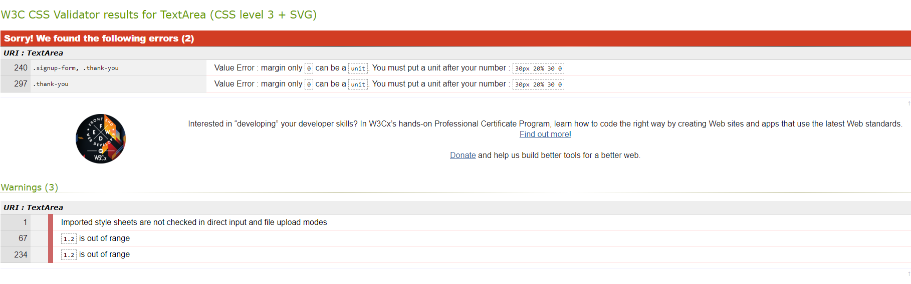
    
* ### Unresolved

    * CSS
    A media component related error was discovered:
    'Import statements do not load in parallel css (importStatement)'.
    A solution is being pursued.
    
    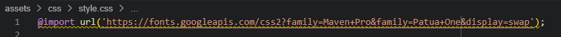

## Additional Testing

### Lighthouse

The site has also been tested by [Google Lighthouse](https://developers.google.com/web/tools/lighthouse) in Chrome Developer Tools. Each page in the website has been analyzed the performance, best practices, accessibility and SEO.

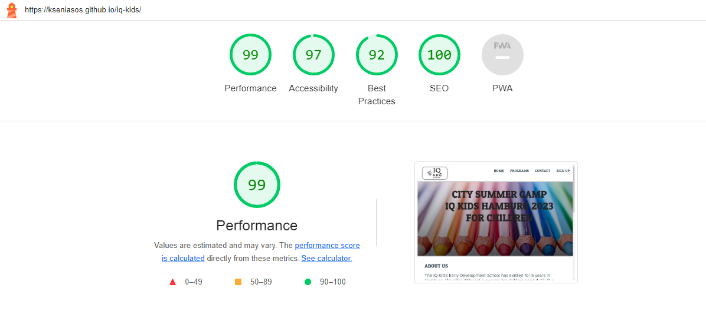

# Deployment

### **Deploying the project**

The site was deployed for GitHub pages. The steps to deploy this site are as follows:

  1. In the GitHub repository, navigate to the **Settings** tab.
  2. Once in Settings, navigate to the **Pages** tab on the left hand side.
  3. Under **Source**, select the branch to **main**, then click **save**.
  4. Once the main branch has been selected, the page will automatically be refreshed with a detailed ribbon display to indicate the successful deployment.

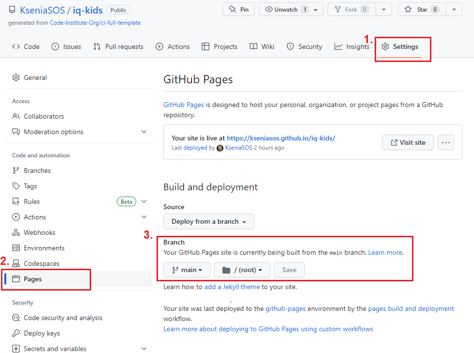

  The live link to the Github repository can be found here -  <https://kseniasos.github.io/iq-kids/>

### **Forking the repository on GitHub**

A copy of the GitHub Repository can be made by forking the GitHub account. This copy can be viewed and changes can be made to the copy without affecting the original repository. Take the following steps to fork the repository:

1. Log in to **GitHub** and locate the [repository](https://kseniasos.github.io/iq-kids/).
2. On the right hand side of the page inline with the repository name is a button called **'Fork'**, click on the button to create a copy of the original repository in your GitHub Account.

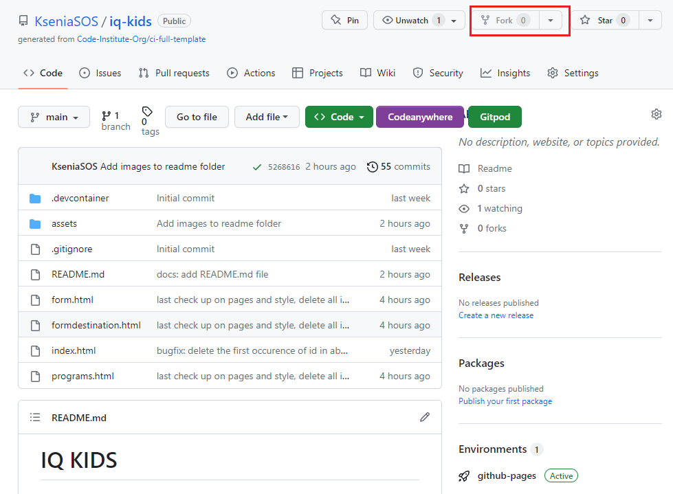

### **Creating a local clone of this project**

The method for cloning a project from GitHub is described below:

1. Under the repository’s name, click on the **code** tab.
2. In the **Clone with HTTPS** section, click on the clipboard icon to copy the given URL.
   
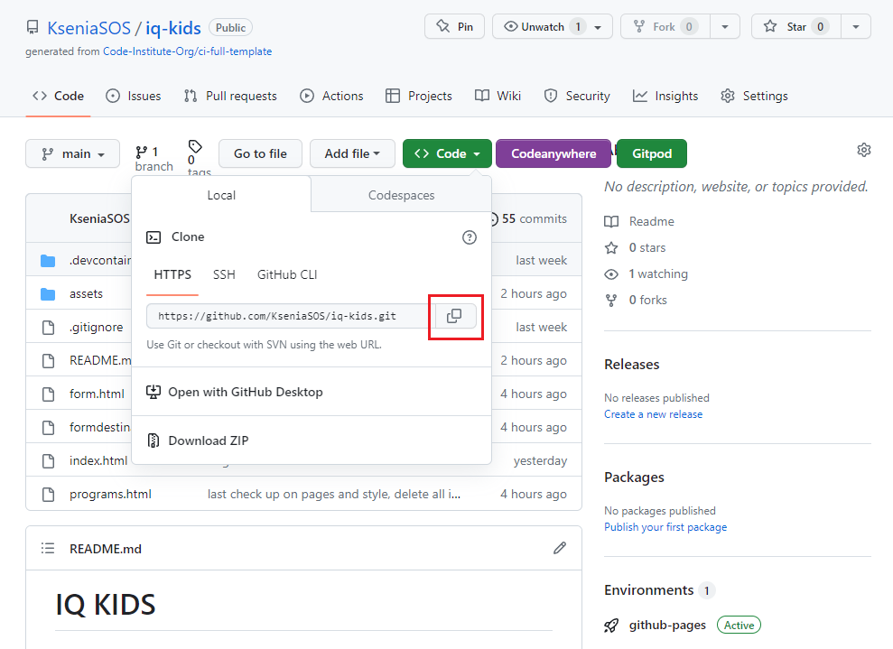

1. In your IDE of choice, open **Git Bash**.
2. Change the current working directory to the location where you want the cloned directory to be created.
3. Type **git clone**, and then paste the URL copied from GitHub.
4. Press **enter** and the local clone will be created.

[Back to top](<#contents>)

# Credits

### Content

* Font - [Google Fonts](https://fonts.google.com/)
* Map - [Google Maps](https://www.google.com/maps)
* Icons - [Font Awesome](https://fontawesome.com/)
* Code - [YouTube tutorial](https://www.youtube.com/@WebCademy)
* Code - [Love Running Code Project](https://learn.codeinstitute.net/ci_program/diplomainfullstacksoftwarecommoncurriculum)
* Wireframes - [Balsamiq](https://balsamiq.com/wireframes/) 
* Images - [Pikwizard](https://pikwizard.com/)
* Images - [Pexels](https://www.pexels.com/)

### Media

* Images were compressed using [Tynypng](https://tinypng.com/)

[Back to top](<#contents>)

### Acknowledgements

I would like to acknowledge the [Code Institute](https://codeinstitute.net/) for the opportunity to work on such a project.
It has been a challenging experience, but I have learned a lot.
Special thanks goes to my family for their continued support and patience.
